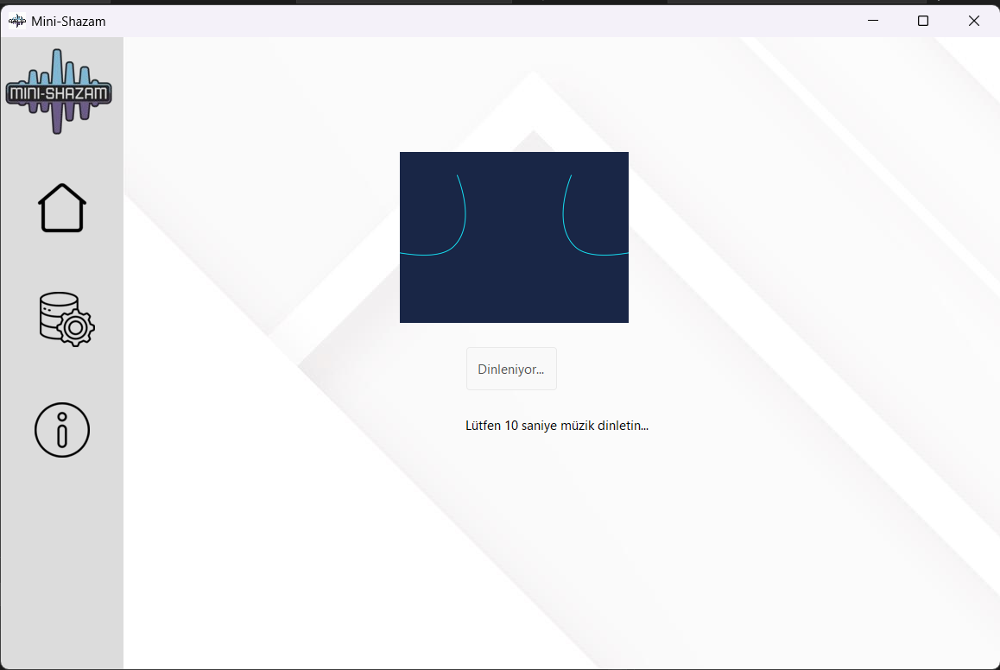
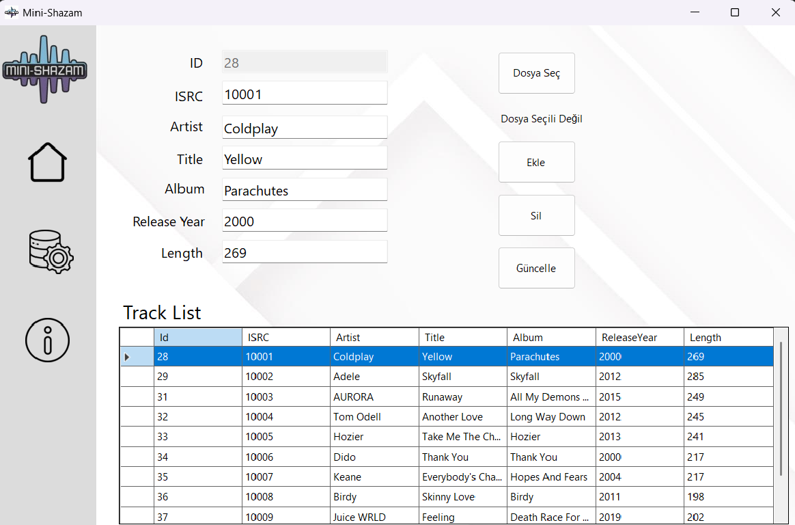
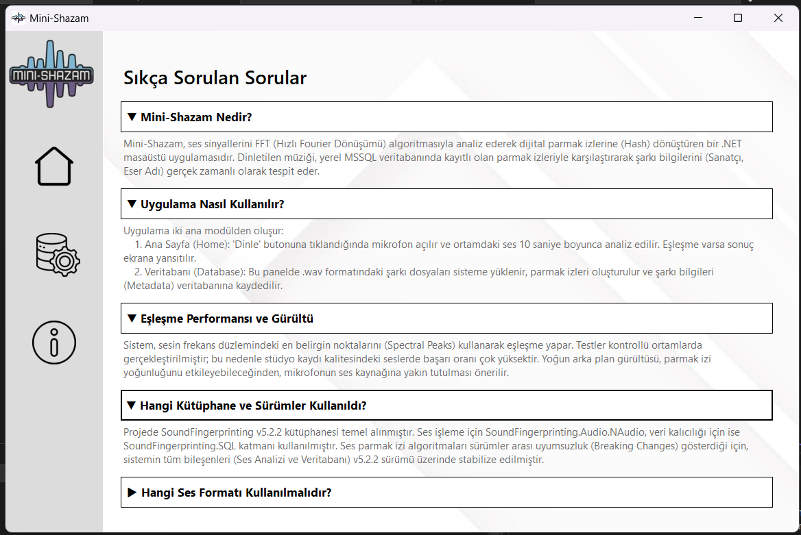

# Screenshots

Here is a preview of the Mini-Shazam application:

### Home Page


### Database View


### Info & About


---

# Database Setup

This application uses Microsoft SQL Server to store audio fingerprints and track metadata.

### Requirements
*   Microsoft SQL Server (LocalDB / Express is sufficient)
*   SQL Server Management Studio (SSMS)

### Database Creation
To create the required database and tables:
1.  Open **SQL Server Management Studio (SSMS)**.
2.  Connect to your local SQL Server instance.
3.  Open the SQL script located at: `/Database Script/DBScript.sql`
4.  Execute the script.
5.  The database **FingerprintsDb** and all required tables will be created automatically.

---

# Audio File Format Requirement

**⚠️ Important:** When adding or analyzing songs, only **WAV** format audio files are supported.

*   **Supported format:** `.wav`
*   **Unsupported formats:** `.mp3`, `.flac`, `.aac`, etc.

Using other formats may cause errors or incorrect fingerprint generation. Please ensure that all audio files are converted to WAV format before using them in the application.

---

### Connection String
Make sure the connection string in `App.config` matches your local SQL Server configuration. It should look like this:

```xml
<?xml version="1.0" encoding="utf-8"?>
<configuration>
	<connectionStrings>
		<add name="FingerprintConnectionString" connectionString="Data Source=.\SQLEXPRESS;Initial Catalog=FingerprintsDb;Integrated Security=True; Connection Timeout=15;" providerName="System.Data.SqlClient"/>
	</connectionStrings>
</configuration>
```
### Credits & Acknowledgments
This project relies on the amazing work provided by the open-source community. Special thanks to:

*   **[SoundFingerprinting](https://github.com/AddictedCS/soundfingerprinting)**: An efficient audio fingerprinting framework for .NET.
*   **[SoundFingerprinting.SQL](https://github.com/AddictedCS/soundfingerprinting.sql)**: SQL Server storage provider for SoundFingerprinting framework.

These libraries are used for the core audio analysis and database operations.
